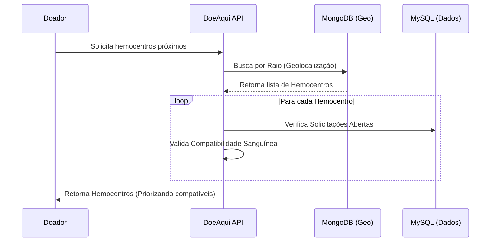

# DoeAqui API 🩸

> **Conectando doadores a quem mais precisa.**


O **DoeAqui** é uma plataforma Open Source de *matching* entre doadores de sangue e hemocentros. O objetivo é facilitar o ciclo de doação, utilizando geolocalização para encontrar hemocentros próximos e algoritmos de compatibilidade sanguínea para direcionar doações a solicitações urgentes.

Atualmente, este repositório contém o **Back-end Monolítico** da aplicação.

---

## 🚀 Funcionalidades Principais

O sistema foi desenhado para cobrir todo o ciclo de vida da doação:

### 👤 Gestão de Usuários (Doador/Paciente)
- **Cadastro Inteligente:** Validação rigorosa de CPF, idade mínima (16 anos) e integridade de dados.
- **Perfil de Saúde:** Gestão de tipo sanguíneo e gênero para cálculos de compatibilidade e intervalos de doação.
- **Segurança:** Autenticação robusta via **Auth0 (JWT)** e exclusão lógica para preservação de histórico.

### 🏥 Hemocentros & Geolocalização
- **Busca Geoespacial:** Utiliza **MongoDB** para localizar hemocentros dentro de um raio específico do usuário.
- **Priorização:** O sistema destaca hemocentros que possuem solicitações compatíveis com o tipo sanguíneo do usuário logado.
- **Gestão:** Cadastro e atualização de status de funcionamento dos hemocentros.

### ❤️ Inteligência de Doação
- **Motor de Compatibilidade:** Lógica de negócio que cruza tipos sanguíneos (Doador vs. Receptor) automaticamente.
- **Ciclo de Solicitação:** Criação e acompanhamento de pedidos de doação (Aberta -> Em Andamento -> Encerrada).
- **Regras de Negócio:** Validação de intervalo entre doações (2 meses para homens, 3 meses para mulheres) e volume doado.

---

## 🛠️ Stack Tecnológica

O projeto utiliza uma stack moderna focada em performance e manutenibilidade:

- **Linguagem:** Java 25
- **Framework:** Spring Boot 3.5.7
- **Database Relacional:** MySQL (Dados cadastrais e transacionais)
- **Database NoSQL:** MongoDB (Geolocalização e matching espacial)
- **API Standards:** OpenAPI (Abordagem *Contract First*)
- **Migrations:** Flyway
- **ORM/Mapping:** JDBI & MapStruct
- **Testes:** H2 Database
- **Segurança:** Spring Security + Auth0

---

## 🧩 Arquitetura e Fluxo

O sistema utiliza uma abordagem **Contract First**, onde a API é definida antes da implementação, garantindo contratos estáveis. Abaixo, um fluxo simplificado do processo de Matching:



---

## 🏁 Como Rodar o Projeto

### Pré-requisitos
* Java JDK 25
* Docker & Docker Compose (para subir MySQL e MongoDB)
* Maven

### Passo a Passo

1.  **Clone o repositório:**
    ```bash
    git clone https://github.com/luisfmaiadc/sboot-doe-aqui-monolith.git
    cd doeaqui
    ```

2.  **Configure as Variáveis de Ambiente:**
    Crie um arquivo `.env` ou configure no seu sistema operacional as credenciais do banco e do Auth0:
    ```properties
    DB_URL=jdbc:mysql://localhost:3306/dbDoeAqui
    MONGO_URI=mongodb://localhost:27017/dbDoeAquiGeo
    AUTH0_ISSUER_URI=DoeAqui
    ```

3.  **Suba os Bancos de Dados:**
    Certifique-se de ter o Docker rodando e execute:
    ```bash
    docker-compose up -d
    ```

4.  **Compile e Execute:**
    ```bash
    mvn spring-boot:run
    ```

5.  **Acesse a Documentação da API:**
    Após iniciar a aplicação, o Swagger UI estará disponível em:
    `http://localhost:8080/swagger-ui.html`

---

## 🫱🏿‍🫲🏻 Como Contribuir

Este é um projeto Open Source e toda ajuda é bem-vinda!

Leia nosso [CONTRIBUTING.md](https://github.com/luisfmaiadc/sboot-doe-aqui-monolith/blob/main/CONTRIBUTING.md) para mais detalhes sobre como abrir Pull Requests.

---

## 📝 Licença

Este projeto está sob a licença MIT. Veja o arquivo [LICENSE](https://github.com/luisfmaiadc/sboot-doe-aqui-monolith/blob/main/LICENSE) para mais detalhes.

---

## 👨🏽‍💻 Autor

**Luis Felipe Maia da Costa**
*Idealizador e Desenvolvedor Backend*

Entre em contato ou acompanhe o desenvolvimento:
* [LinkedIn](https://www.linkedin.com/in/luis-felipe-maia-da-costa/)
* [Email](mailto:lf.mcosta23@gmail.com)

---
*Feito com ❤️ para salvar vidas.*